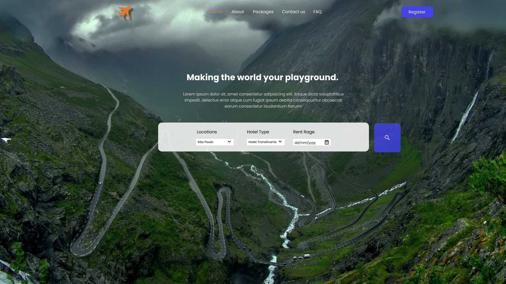

<h1 align="center"> Rocket Travel </h1>

O Rocket Travel é um desafio desenvolvido pelo João Inácio Neto. 

  <a href="#-tecnologias">Tecnologias</a>&nbsp;&nbsp;&nbsp;|&nbsp;&nbsp;&nbsp;
  <a href="#-projeto">Projeto</a>&nbsp;&nbsp;&nbsp;|&nbsp;&nbsp;&nbsp;
  <a href="#-layout">Layout</a>&nbsp;&nbsp;&nbsp;|&nbsp;&nbsp;&nbsp;
  <a href="#memo-licença">Licença</a>

  

 

  

## 🚀Tecnologias

Esse projeto foi desenvolvido com as seguintes tecnologias:

- HTML e CSS
- Git e Github
- Figma

## 💻 Projeto

O Rocket Travel é um site para agendamento de Hotel.

- [Visite o projeto online](https://luad3cristal.github.io/rocket-travel/)

## 🔖 Layout

Você pode visualizar o layout do projeto através [desse link](https://www.figma.com/file/MOrKnXFQqWCz01Ei1KJnCO/Rocket-Travel?type=design&node-id=1-2&mode=design&t=LS5c0pkD5TABOZqk-0). É necessário ter conta no [Figma](https://figma.com) para acessá-lo.
 
Caso queira, você pode acessar o github original [nesse link](https://github.com/birobirobiro/live-twitch-rocket-travel).

## :memo: Licença

Esse projeto está sob a licença MIT.
